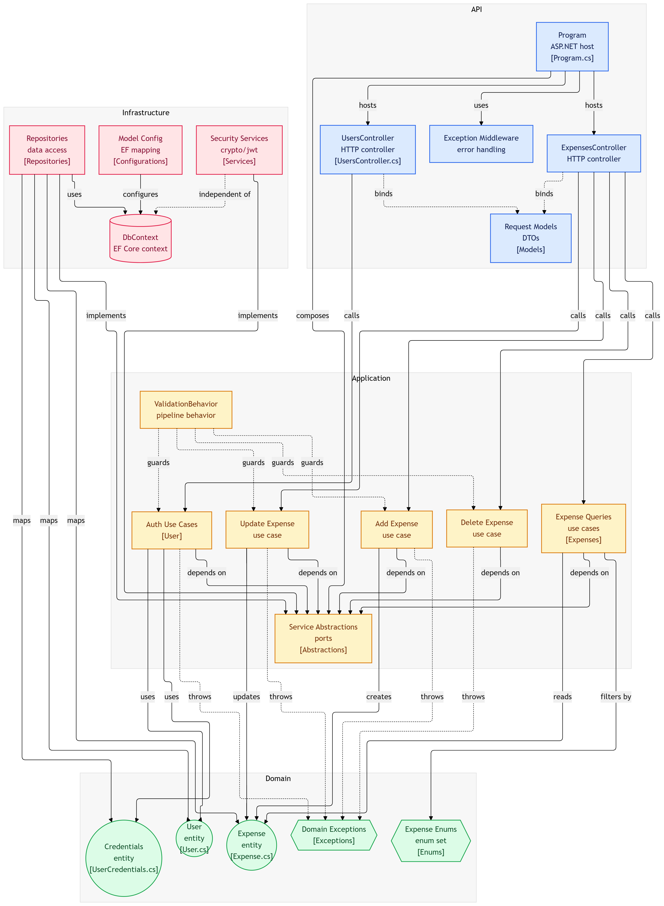

# Expense Tracker API

A RESTful API for tracking personal expenses. Users can register, authenticate, and manage their own expenses with filtering by date range.

> ⚠️ This is a personal learning project. No expenses were harmed in the making of this API.

---

## Architecture Diagram


*Generated with [gitdiagram.com](https://gitdiagram.com)*
---

## Tech Stack

- **ASP.NET Core 10** — web framework
- **Entity Framework Core** + **PostgreSQL** — data persistence
- **MediatR** — CQRS pattern (commands & queries)
- **FluentValidation** — input validation via pipeline behavior
- **BCrypt.Net** — password hashing
- **JWT Bearer** — authentication
- **Scalar** — API documentation UI

---

## Architecture

Clean Architecture with 4 layers:

```
ExpenseTracker.Domain          # Entities, enums, exceptions
ExpenseTracker.Application     # CQRS handlers, validators, abstractions
ExpenseTracker.Infrastructure  # EF Core, repositories, JWT, BCrypt
ExpenseTracker.Api             # Controllers, middleware, Program.cs
```

Key patterns:
- **CQRS** via MediatR — commands mutate state, queries read state
- **Repository + Unit of Work** — abstracts data access
- **Pipeline Behavior** — validation runs automatically before every handler
- **Always-valid domain model** — entities validate in constructors

---

## Getting Started

### Prerequisites

- .NET 10 SDK
- PostgreSQL

### Configuration

Copy `appsettings.json` and fill in:

```json
{
  "ConnectionStrings": {
    "DefaultConnection": "Host=localhost;Database=expense_tracker;Username=postgres;Password=yourpassword"
  },
  "Jwt": {
    "SecretKey": "your-secret-key-min-32-chars",
    "Issuer": "expense-tracker-api",
    "Audience": "expense-tracker-client",
    "ExpirationMinutes": 60
  }
}
```

### Run Migrations

```bash
dotnet ef database update --project ExpenseTracker.Infrastructure --startup-project ExpenseTracker.Api
```

### Run

```bash
dotnet run --project ExpenseTracker.Api
```

API documentation available at: `https://localhost:{port}/scalar`

---

## API Endpoints

### Auth
| Method | Endpoint | Description |
|--------|----------|-------------|
| POST | `/api/users/register` | Register a new user |
| POST | `/api/users/login` | Login and receive JWT token |

### Expenses (requires JWT)
| Method | Endpoint | Description |
|--------|----------|-------------|
| POST | `/api/expenses` | Create expense |
| GET | `/api/expenses` | Get all user expenses |
| GET | `/api/expenses/{id}` | Get expense by ID |
| PUT | `/api/expenses/{id}` | Update expense |
| DELETE | `/api/expenses/{id}` | Delete expense |
| GET | `/api/expenses/filter` | Filter expenses by date range |

#### Date Filter Query Parameters
| Parameter | Type | Description |
|-----------|------|-------------|
| `filter` | `PastWeek \| PastMonth \| LastThreeMonths \| Custom` | Filter type |
| `startDate` | `DateTime?` | Required when filter is `Custom` |
| `endDate` | `DateTime?` | Required when filter is `Custom` |

---

## Running Tests

```bash
dotnet test
```
